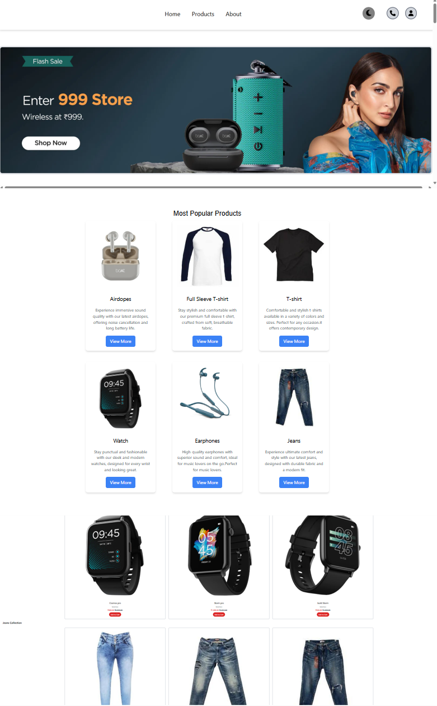
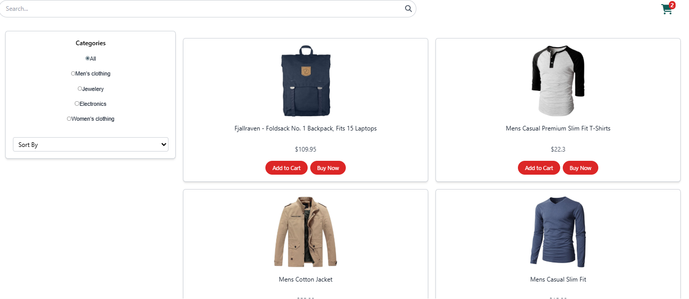
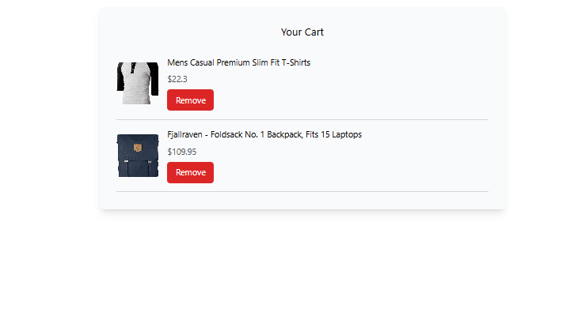
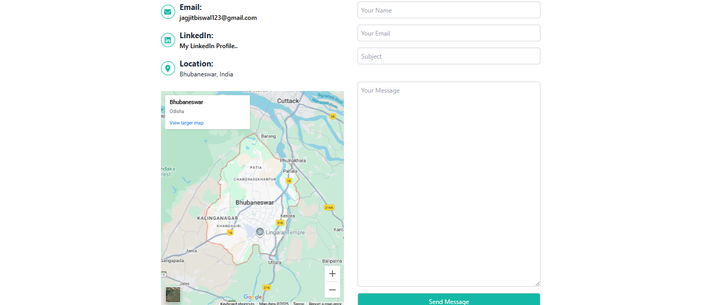

# Project Title: ShopNow - E-commerce Website

# 📖 Description: 
This project is a frontend-based E-Commerce Website designed to provide users with an engaging shopping experience. It includes features such as product search, category-based filtering, price sorting, light/dark mode customization, and real-time cart management. The website is fully responsive and optimized for all device sizes, ensuring smooth accessibility and usability across mobile, tablet, and desktop screens.

# 🛠️ Tech Stack:
- HTML5
- Tailwind CSS
- JavaScript
- React
- React Router
- Axios Library
- Vite

# 🚀 Features: 
- Responsive Design: Optimized for all screen sizes, ensuring a consistent user experience on mobile, tablet, and desktop devices.
  
- Product Search: Users can quickly find products by entering keywords or names.

- Category Filtering: Products can be filtered based on categories for easier navigation.

- Sorting Functionality: Users can sort products by price (low-to-high / high-to-low) for better decision-making.

- Theme Customization: Light and dark modes are available, allowing users to personalize their browsing experience.

- Cart Management: Users can add or remove products, with the cart count updating in real time for convenience.

🌐 Website Preview:
HomePage: 
ProductPage: 
CartSection: 
contactPage: 
Footer: 
LoginPage: 
SignUpPage: 
🌐 Website Preview :

